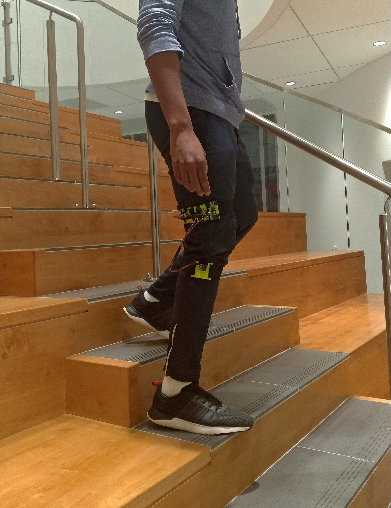
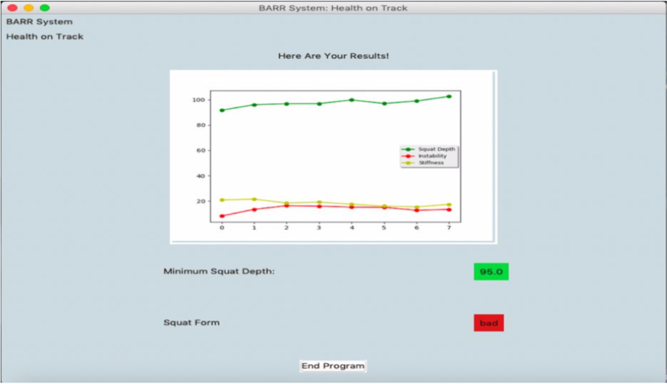

# BARR-SYSTEM
BARR-SYSTEM is a multi-layered service package that assists knee injury patients throughout their rehabilitation process. A patient is now able to wear a 3D motion tracking knee strap to monitor their technique and movement quality while performing take-home exercises. Exercise results can be accessed in real time on a desktop patient portal, which displays performance measurements in intuitive graphics and issues alerts if the system detects false techniques of the patient. Such assistance improves recovery efficiency while reducing the risk of recursive injuries and the amount of visits needed to physical therapists. 

## Technical Overview

BARR-SYSTEM embodies the idea of applying machine learning to real time movement pattern classification and diagnostics. The knee brace as shown in the picture to the left consists of 2 Inertial Mass Units (IMU) connected to an Arduino Nano controller, which communicates with a desktop computer to transfer user data and provide real time feedback. Translational and rotational movement data collected by the IMU sensors are fused together to calculate functional measurements of the knee joint. A machine learning algorithm called Support Vector Machine (SVM) is used to identify bad squatting techniques from the good. BARR-SYSTEM innovation group members performed 95 repetitions of squats with both good and bad techniques to train the algorithm. After each set of exercise, the analysis results from the trained SVM algorithm is displayed in the patient dashboard as shown below. Measurements of squat depth and lower body stability and stiffness are calculated for each repetition. The overall quality of the set is given a rating of either good or bad. 

The project overview can be found in our [final presentation](https://docs.google.com/presentation/d/1lwq6di_xf7Fpfg2tNYc-__XR5C5PFBZ8-7M5JFw1V5M/edit?usp=sharing). 
Complete technical detail can be found in our [final project report](https://drive.google.com/file/d/1XP90V2jUkUDXjpgdI9bchQbZ_EEaV_wm/view?usp=sharing). 

## Acknowledgements
BARR-SYSTEM is a part of the Rutgers Industrial and Systems Engineering Class of 2019 Senior Design. BARR-SYSTEM innovation group consists of the following individuals:
- Bangaly Diane: bd332@rutgers.edu
- Arjun Pawar: asp191@rutgers.edu
- Rushiraj Parikh: rushirajparikh@gmail.com
- Ran Wei: rw422@rutgers.edu

This project wouldn't have been completed without our supportive colleagues and professors: Prof. Susan Albin, Alex Ameri, Andrew Benton, Mary Jo Bronson, Prof. Kimberly Cook-Chennault, Kassem Darwiche, Prof. Mohsen Jafari, Alaaeldin Olleak, Joshua Sosoo, Chi Hong Wong. 

